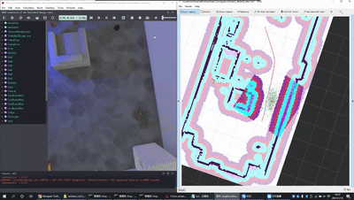
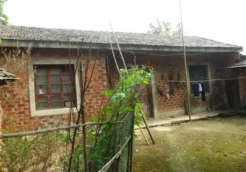
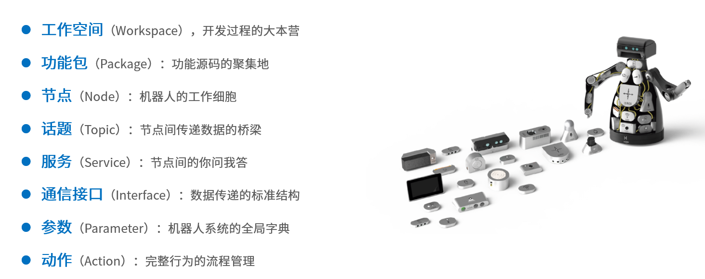

# 导读：ROS2入门
## 目录
- [导读：ROS2入门](#导读ros2入门)
  - [目录](#目录)
  - [1.为什么要学习ROS2？](#1为什么要学习ros2)
  - [ROS2的特点](#ros2的特点)
  - [有了ROS1为什么还要ROS2？](#有了ros1为什么还要ros2)
  - [概念总览](#概念总览)

## 1.为什么要学习ROS2？

假如你想要做一台可以导航、避障的小车，你需要什么知识？

ROS没有出现之前，做一个机器人是非常复杂的一件事情，因为一个机器人需要涉及到多个部分，而且这些部分之间还要进行**通信**。

例如设计一个像下图一样的轮式移动机器人，我们对其进行拆解。可以分为**感知、决策、控制**三个部分。 

- **感知部分**有：激光雷达、深度相机、IMU、里程计、碰撞感知、建图
- **决策部分**有：路径规划（navigation）算法、定位算法
- **控制部分**有：轮子驱动

如果想要整个机器人可以跑起来，那么必须要有一个东西将上面的几个部分合理的连接到一起，这个东西就是ROS。

  
**ROS的作用就像我们的身体的神经系统一样，通过神经系统将我们身体的各个部分接入大脑。**

## ROS2的特点
1. **提高机器人软件复用率**
提高机器人软件复用率，这个目标简单来讲就是**不要重新造轮子**。
ROS怀揣“**提高机器人软件复用率**”的目标，促使社区快速发展和繁荣，时至今日，ROS已经广泛用于各种机器人的开发，无论是机械臂、移动机器人、水下机器人，还是人形机器人、复合机器人，统统都可以看到ROS的身影，ROS已经成为机器人领域的普遍标准。

2. **通信机制**
其中一个比较重要的特点是通信机制对于机器人运动的各种场景，ROS2提供了丰富的通信机制，例如：
- 话题（Topic）：一种消息传递机制，用于一对多的发布/订阅模式。
- 服务（Service）：一种请求/响应模式，用于一对一的通信。
- 动作（Action）：一种更复杂的通信机制，用于实现任务的分解和执行。
没有接触过ROS2的同学可能对此没有太多感触，因此我们具体遇到的时候再详细介绍。
3. **庞大的社区**
ROS2拥有庞大的社区，这意味着你可以轻松地找到大量的资源和支持，无论是文档、教程、示例代码还是开源项目，ROS2的社区都能为你提供帮助。

## 有了ROS1为什么还要ROS2？

这里直接摘取鱼香ROS2的介绍：

讲个故事，小鱼小时候，鱼爸鱼妈决定给小鱼盖一个新房，留着将来取媳妇，当时盖房子还不用钢筋混凝土，也没有啥设计图，一砖一瓦加上木制大梁就盖好了。盖好房子一家人开心的住了进去之后才发现没有建厕所，后来只能把杂物室给拆出来一空间建了厕所。

若干年后，小鱼出息了年薪百万，自然要过无比奢华糜烂的生活，什么样的生活才算无比奢华糜烂？

肯定要有一个全自动洗衣机，于是小鱼决定给家里买个洗衣机，某东上买好送到家，安装师傅一到小鱼家，人给整蒙了，连个下水道都没有。师傅说小鱼必须要先装个下水道，小鱼想了一下这咋办，盖房子时根本没想到会用洗衣机。

与其重新挖个下水道，不如直接盖个大楼房，请个专业设计师，用上最新最好的的材料，给邻居看看啥叫`壕无鱼性`

小鱼的故事讲完啦，接着说说ROS和ROS2，2007年ROS开发人员设计和制作ROS时，当时只想着**简化机器人的开发**，并没有想到过今天那么多的功能需求，比如商业化要求的稳定性、生命周期管理、多机协同、数据加密等。就像小鱼建房子时没想要未来会用全自动洗衣机一样~

ROS发展的后面的几年里，机器人对ROS的功能要求越来越多，ROS开发人员只能在原有的ROS上修修补补。

随着ROS不断的添加新功能，ROS变得越来越臃肿，祖传代码也越来越多。ROS开发人员发现在原有的ROS架构上修修补补十分消耗头发，于是像小鱼决定把房子推倒重建一样，ROS官方也重新设计制作了ROS2。

**一言蔽之，就是ROS1太老了，通信延迟、可扩展性差，用ROS2才能跟上时代（**

## 概念总览
在接下来的教程中，我们会逐渐学习到这些内容：
