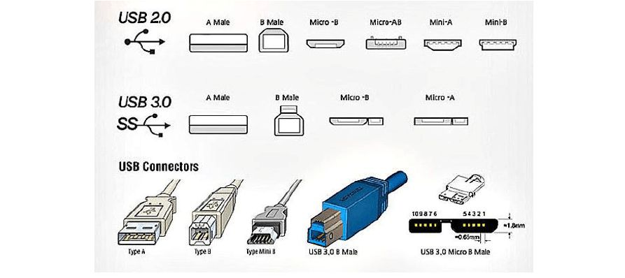

## 目录

- [目录](#目录)
- [通信口](#通信口)
  - [接口是什么？](#接口是什么)
  - [为什么使用接口](#为什么使用接口)
- [自定义通信接口](#自定义通信接口)
  - [为什么要自定义通信接口？](#为什么要自定义通信接口)
  - [自定义接口实践](#自定义接口实践)
  - [自定义话题接口（msg）](#自定义话题接口msg)
  - [生成接口代码](#生成接口代码)
  - [使用自定义消息接口](#使用自定义消息接口)
- [服务](#服务)
- [服务通信介绍](#服务通信介绍)
- [服务通信实践](#服务通信实践)
- [查看服务接口](#查看服务接口)
- [编写服务节点](#编写服务节点)
  - [\*在VSCode中实现对自定义接口的代码补全](#在vscode中实现对自定义接口的代码补全)


## 通信口
### 接口是什么？
接口是ROS2提前定义的一种规范。

上图就是一个服务接口。名字是AddTwoInts，输入参数为a和b，输出参数为sum。

### 为什么使用接口
举一个雷达的例子，不同的厂家生产出不同的类型的激光雷达，每种雷达驱动方式、扫描速率等等都不相同。

当机器人进行导航时，需要激光雷达的扫描数据，假如没有统一接口，每次更换一个种类的雷达，都需要重新做程序适配。

于是ROS2中定义了一个统一的接口叫做sensor_msgs/msg/LaserScan,现在几乎每个雷达的厂家都会编写程序将自己雷达的数据变成sensor_msgs/msg/LaserScan格式，提供给用户使用。
我们可以用如下命令查看ROS为我们提供的一些接口:
```bash
ros2 interface package sensor_msgs
ros2 interface package std_msgs
```

如果雷达的例子不好理解，大家可以把雷达换成手机充电器，USB接口是不是也是一种规范，所有的厂家都按照这种接口进行充电器和连接线的生产。

在TypeC出现之前，各种充电器、连接线五花八门，给用户造成了不小的困扰。TypeC的出现，让各种充电器、连接线都统一了接口，极大地方便了用户的使用。


## 自定义通信接口
### 为什么要自定义通信接口？
既然ROS2已经定义了丰富的接口，为什么我们还要自定义接口呢？  
因为ROS2已经定义的接口并不能满足我们的所有的需求，需要我们根据具体任务需求自定义接口。
通信接口包括话题接口、服务接口和动作接口，都大同小异，这里我们只讲话题接口和服务接口。
### 自定义接口实践
使用如下命令创建一个自定义接口功能包
```bash
ros2 pkg create my_interfaces --build-type ament_cmake --dependencies rosidl_default_generators std_msgs 
```
- `std_msgs`是ROS2提供的标准接口
- `rosidl_default_generators`是ROS2提供的生成接口代码的工具，有了它，我们只需要编写接口文件，他就会自动生成接口代码，不需要我们手动敲。

### 自定义话题接口（msg）
在该功能包下，新建一个msg目录，并且创建一个msg文件：
**注意：这里的msg文件名不能用下划线，这是ROS2规定的不是我说的（）**

**Article.msg**
```
std_msgs/UInt32 chapter
std_msgs/String title
std_msgs/String content
```
这里定义了一个小说的话题接口，包括章节、标题和内容。
注意：这里变量名首字母得小写，这也是ros规定的（汗）

### 生成接口代码
刚才的步骤已经完成创建接口文件了，接下来的步骤是让ROS知道存在这样一个接口文件。
编写CMakelists.txt文件：
```cmake
find_package(rosidl_default_generators REQUIRED)
find_package(std_msgs REQUIRED)
# 添加下面的内容
rosidl_generate_interfaces(${PROJECT_NAME}
  "msg/Article.msg"
  DEPENDENCIES std_msgs 
)
# 添加上面的内容
```
同时编写package.xml文件：
```xml
  <buildtool_depend>ament_cmake</buildtool_depend>


<!-- 如果没有这两句就添加上去 -->
  <depend>rosidl_default_generators</depend>
  <depend>std_msgs</depend>
<!-- 如果没有这两句就添加上去 -->


<!-- 特别地还要添加这句，不然会报错 -->
<member_of_group>rosidl_interface_packages</member_of_group>
<!-- 特别地还要添加这句，不然会报错 -->

  <test_depend>ament_lint_auto</test_depend>
```
然后回到工作空间进行编译：
```bash
colcon build --packages-select my_interfaces
source install/setup.bash
``` 
完成后就可以用`interface list`查看自定义的接口：
```bash
ros2 interface list |grep Article
```

### 使用自定义消息接口
我们这里以自定义话题接口为例，实现一个发布者，发布文章信息.
1. 先回到workspace，source install/setup.bash
2. 在my_interfaces功能包下创建一个script文件夹，编写python文件：
**test_interface.py**
```python
import rclpy
from rclpy.node import Node
from my_interfaces.msg import Article  # 导入自定义消息 Article
from std_msgs.msg import String  # 导入标准 String 消息
from std_msgs.msg import UInt32  # 导入标准 UInt32 消息
class ArticlePublisher(Node):
    def __init__(self):
        super().__init__('article_publisher')  # 初始化节点名称
        self.publisher_ = self.create_publisher(Article, 'article_topic', 10)  # 创建发布者，主题为 'article_topic'
        self.timer = self.create_timer(1.0, self.publish_article)  # 每1秒调用一次 publish_article 方法
        self.current_chapter = 5  
    def publish_article(self):
        # 创建 Article 消息
        article = Article()
        article.chapter = UInt32()  # 创建 UInt32 类型的章节
        article.chapter.data = self.current_chapter+230  # 设置chapter data
        article.title = String()  # 创建 String 类型的标题
        article.title.data = f"第 {article.chapter.data}回"  # 设置标题
        if self.current_chapter % 2 == 1:
            content=f"{self.current_chapter}条悟：你才是挑战者"
        else:
            content=f"{(self.current_chapter-1)/2}条悟：很抱歉没能让宿傩大人使出全力"
        article.content = String()  # 创建 String 类型的内容
        article.content.data = content  
        self.publisher_.publish(article)  # 发布消息
        self.get_logger().info(f'Publishing: Chapter {article.chapter.data}, Title: {article.title.data}, Content: {article.content.data}')  # 打印日志
        self.current_chapter += 1  # 章节加1

def main(args=None):
    rclpy.init(args=args)  # 初始化 ROS2
    article_publisher = ArticlePublisher()  # 创建 ArticlePublisher 实例
    rclpy.spin(article_publisher)  # 持续运行节点
    article_publisher.destroy_node()  # 销毁节点
    rclpy.shutdown()  # 关闭 ROS2

if __name__ == '__main__':
    main()
```
然后运行python test_interface.py（懒得写setup.py了）

在rqt里面也可以看到这个话题：
1. 新开一个终端
2. 由于interface是自定义的，所以需要先source install/setup.bash(没有source是无法查看这个自定义接口的！)
3. 运行rqt，查看对应的topic

## 服务 
## 服务通信介绍
服务分为客户端和服务端，平时我们用的手机APP都可以成为客户端，而APP服务器对于软件来说就是服务端。
客户端发送请求给服务端，服务端可以根据客户端的请求做一些处理，然后返回结果给客户端。

所以服务-客户端模型，也可以成为请求-响应模型。
> 不知道你有没有感觉到服务和话题的不同之处，话题是没有返回的，适用于单向或大量的数据传递。而服务是双向的，客户端发送请求，服务端响应请求。


单个客户端如图所示

多客户端如图所示
## 服务通信实践
以下是一个简单的例子，使用服务实现两个数的相加。
在终端中运行：
```bash
ros2 run examples_rclcpp_minimal_service  service_main
```
这里它不会有输出，但是服务已经启动了。
打开rqt，点击Services->Service Caller，点击刷新并找到AddTwoInts

我们任意修改a和b之后，点击Call Service，就可以得到结果了。

> #结果可能长这样：
> example_interfaces/srv/AddTwoInts.Response
> sum int64        114514
## 查看服务接口

rqt为我们提供了方便快捷的**查询接口文档**的方法：Type Browser。
Type Browser有Service Type Browser Action Type Browser和Message Type Browser，分别用于查看服务、动作和消息接口。这里选择Service Type Browser。

找到plugins->example_interfaces->AddTwoInts->加号添加，可以看到它的Request和Response都长什么样。
如图，输入为a和b，输出为sum，实现两数相加。

## 编写服务节点
现在我们编写一个服务节点，实现发布两数相加的服务。
1. 在workspace/src下创建功能包：
```bash
ros2 pkg create my_service --node-name my_service_node --dependencies example_interfaces rclpy --build-type ament_python
```
由于AddTwoInt是ROS官方提供的实例接口，作用域在example_interfaces下，所以
2. 在源文件中编写服务节点：
```python

from example_interfaces.srv import AddTwoInts
import example_interfaces.srv
import rclpy
from rclpy.executors import ExternalShutdownException
from rclpy.node import Node


class MinimalService(Node):

    def __init__(self):
        super().__init__('a_service')
        self.srv = self.create_service(AddTwoInts, 'add_two_ints', self.add_two_ints_callback)

    def add_two_ints_callback(self, request, response):
        response.sum = request.a + request.b
        self.get_logger().info('Incoming request\na: %d b: %d' % (request.a, request.b))

        return response


def main(args=None):
    try:
        rclpy.init()
        minimal_service = MinimalService()

        rclpy.spin(minimal_service)
    except (KeyboardInterrupt, ExternalShutdownException):
        print("external interrupt")
        pass


if __name__ == '__main__':
    main()
```
3. 回到工作空间进行编译：`colcon build --packages-select my_service` 

4. 运行服务节点：`ros2 run my_service my_service_node`
5. 现在我们的服务节点已经运行起来了，可以在rqt中查看服务节点：

(注：图文不完全一样)
可以在rqt中调用服务进行测试。


<span style="font-size:20px; color:blue;">

现在请你动手实践
   1. 打开example_workspace中的功能包example_service，找到代码源文件
   2. 替换用注释块包围起来的内容，使其可以正常运行
   3. 使用rqt，或者命令行对服务进行调用测试

</span>  


### *在VSCode中实现对自定义接口的代码补全
对于ROS2原生的接口，或者库，只要包含了官方的库就可以实现自动补全

如图，rclpy、Node都是绿色的，代表编辑器可以找到他们对应的文件。

但是对于自定义接口，VSCode并不能自动地找到你的自定义接口，因此需要我们手动添加complete path才能实现代码补全。

如图，找不到包，它是白色的。

现在我带大家用VSCode过一遍找自定义接口，实现代码补全的流程。
1. 打开仓库里的example_workspace
2. 在该workspace下运行命令：
```bash
colcon build --packages-select auto_complete_interfaces
source install/setup.bash
```
注意，一定要--packages-select，因为其他包不一定能通过编译
auto_complete_interfaces是我提前写好的一个interface，里边有一个AutoComplete.msg：
```
int32 a
int32 b
int32 c
int32 d
```
3. 在**src**下新建一个功能包测试能不能找到这个自定义接口，命令如下：
```bash
ros2 pkg create auto_complete_test --build-type ament_python --node-name  auto_complete_test_node
```

4. 用VSCode，打开example_workspace：`code example_workspace`,并找到auto_complete_test_node.py
5. 在该文件中尝试import自定义接口:
```python
from auto_complete_interfaces.msg import AutoComplete
```

通常情况下我们会发现，VSCode并不能找到这个自定义接口，AutoComplete为白色。
rosidl_default_generators 的工作原理是将定义的接口文件（如消息和服务）转换为 Python 和 C++ 的头文件。
因此，只要能找到它生成的头文件位置，并且添加到python的auto complete path，或者c++ extension的include path，我们就能在VSCode中实现代码补全，爽爽写代码。
6. 一通寻找，最后在.../workspace/install/auto_complete_interfaces/local/lib/python3.10/dist-packages
这个地方找到了rosidl生成的文件

看看这个class：`class AutoComplete(metaclass=Metaclass_AutoComplete):`，这不正是我们要找的接口类？

7. 因此,只要让Python知道这个路径的位置，就可以实现自动补全。
如果你**已经安装过ROS插件**，那么在打开workspace的时候，插件会在.vscode文件夹中自动生成两个文件：c_cpp_properties.json settings.json，里面包含了一些基本的autoComplete includePath。

8. 打开settings.json，在`"python.autoComplete.extraPaths"`和`"python.analysis.extraPaths"`下分别添加刚才找到的路径：
```
....../example_workspace/install/auto_complete_interfaces/local/lib/python3.10/dist-packages
```
再回到刚才的py文件，我们发现AutoComplete已经变成绿色了，而且按住ctrl后点击AutoComplete，可以跳转到定义处。


9. 然后我们就可以在VSCode中愉快地写代码了。上面只演示了Python，C++也是同理，只需要在c_cpp_properties.json中添加includePath即可。

然而，即使能够实现代码补全，想要在VSCode中直接运行包含自定义接口的代码还是会遇到各种各样的问题。因此我们一般**在编写代码的时候用VSCode，在运行代码的时候还是用终端。**


