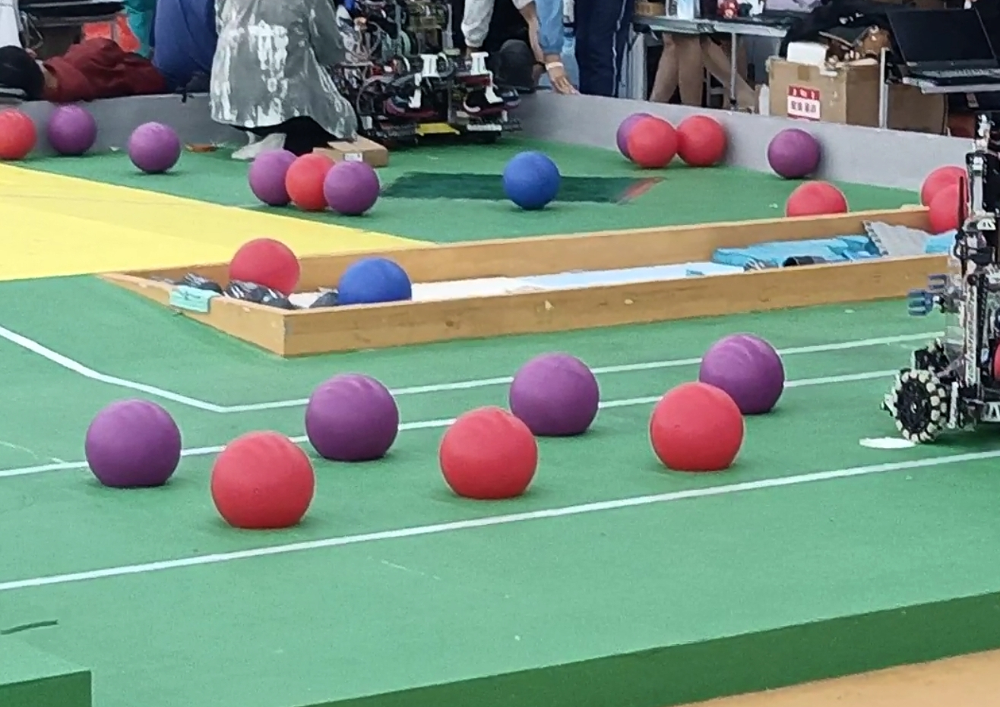

## assignment4

## 作业要求
1. 编写一个ROS2节点，名为`color_ball_publisher`,持续读取balls.jpg并发布为`balls_img`话题。（这里本来应该是持续发布摄像头话题的，但是考虑到过于复杂，这里改为每次发布同一张图片.注意，图片读取**最好用绝对路径**，因为ros2 run 不是直接执行你的python源文件，而是复制一份到install下的，如果用相对路径就会从这个路径下找而不是你的源文件路径下）

2. 编写一个ROS2节点，名为`color_ball_detector`,
   1. 订阅`balls_img`话题
   2. 检测图片中**指定颜色**的球，画出边界框后发布绘制完成的图片到`balls_img_detected`话题
   3. 创建一个服务接口`ChangeColor`，Request为`string color`，Response为`bool success`，是否成功修改颜色
   4. 创建一个服务`change_color_service`,调用`ChangeColor`服务接口，当收到请求时，修改`color_ball_detector`节点检测的颜色.请求在后期使用rqt或者命令行工具发送
## 提交内容
1. 一个workspace文件夹，在src下面包含`color_ball_publisher`和`color_ball_detector`两个package，目录结构如下：
```
workspace/
├── src/
│   ├── color_ball_detector/
│   ├── color_ball_publisher/
```
**不要提交除了src以外的文件夹**，如build，install等。在验证完成你的代码后，请删除无关文件夹，仅保留src。
2. 一份文档，命名为`名字_报告.md`，包含：
   1. 截图：当前检测颜色为红色时，发布的balls_img_detected截图
   2. 截图：使用服务修改检测颜色为蓝色时，发布的balls_img_detected截图
   3. 截图：使用服务修改检测颜色为紫色时，发布的balls_img_detected截图
   4. *心得体会：在做这个任务时的心得体会，不强求，不算分

（发布的图像信息可以这样查看：rqt->plugins->Visulization->Image View ，找到你发布的话题）

>PS:节点可以用C++，也可以用Python编写，C++偏难，需要下载OpenCV C++，喜欢挑战的小伙伴可以尝试（）

## 可能需要的背景知识
由于我们使用OpenCV打开摄像头，而OpenCV图像的数据类型和ROS2的sensor_msgs/msg/Image数据类型并不一致，所以我们这里需要用到一个叫cv_bridge的包，将OpenCV的数据类型转换为ROS2的数据类型。
使用如下命令安装cv_bridge:
```bash
sudo apt install ros-${ROS_DISTRO}-cv-bridge ros-${ROS_DISTRO}-image-transport
```
对于humble，这里的ROS_DISTRO就是humble
用法如下：
``` python
bridge = CvBridge()
ros2_image = bridge.cv2_to_imgmsg(opencv_image, encoding='bgr8')# bgr8是sensor_msgs/msg/Image的默认编码，必加的
```
